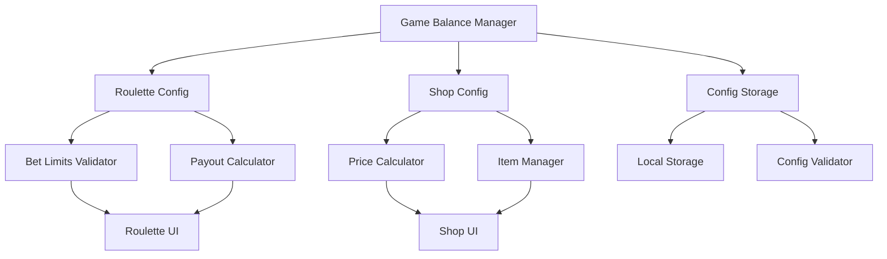

# Design Document: Game Balance Adjustment

## Overview

게임 밸런스 조정 시스템은 룰렛 게임과 상점 시스템의 핵심 파라미터를 동적으로 조정하여 게임의 균형을 개선하는 기능입니다. 이 시스템은 기존 하드코딩된 값들을 설정 가능한 파라미터로 변환하고, 이를 통해 게임 운영자가 실시간으로 게임 밸런스를 조정할 수 있도록 합니다.

현재 시스템 분석 결과:
- 룰렛 시스템: 특수 베팅 최대 3개, 번호 베팅 최대 5개, 번호 배당률 100배로 하드코딩
- 상점 시스템: 강화권과 보호권 가격이 고정값으로 설정
- 설정 저장 메커니즘 부재

## Architecture

### System Components



### Configuration Architecture

시스템은 중앙집중식 설정 관리 방식을 채택합니다:

1. **Config Manager**: 모든 게임 밸런스 설정을 관리하는 중앙 컴포넌트
2. **Storage Layer**: 브라우저 로컬 스토리지를 활용한 설정 지속성
3. **Validation Layer**: 설정값의 유효성을 검증하는 계층
4. **Application Layer**: 각 게임 모듈에서 설정을 적용하는 계층

## Components and Interfaces

### 1. GameBalanceConfig Interface

```javascript
interface GameBalanceConfig {
  roulette: {
    specialBetLimit: number;      // 특수 베팅 최대 개수 (기본: 2)
    numberBetLimit: number;       // 번호 베팅 최대 개수 (기본: 3)
    numberPayoutRate: number;     // 번호 베팅 배당률 (기본: 95)
  };
  shop: {
    enhancementPriceMultiplier: number;  // 강화권 가격 배수 (기본: 1.05)
    protectionPriceMultiplier: number;   // 보호권 가격 배수 (기본: 1.05)
  };
  version: string;                // 설정 버전
  lastUpdated: string;           // 마지막 업데이트 시간
}
```

### 2. ConfigManager Class

```javascript
class ConfigManager {
  constructor();
  loadConfig(): GameBalanceConfig;
  saveConfig(config: GameBalanceConfig): boolean;
  validateConfig(config: GameBalanceConfig): ValidationResult;
  getDefaultConfig(): GameBalanceConfig;
  resetToDefaults(): void;
}
```

### 3. RouletteBalanceManager Class

```javascript
class RouletteBalanceManager {
  constructor(config: GameBalanceConfig);
  validateSpecialBetSelection(currentBets: Array, newBet: string): boolean;
  validateNumberBetSelection(currentBets: Array, newNumber: number): boolean;
  calculateNumberPayout(betAmount: number): number;
  updateUI(): void;
}
```

### 4. ShopBalanceManager Class

```javascript
class ShopBalanceManager {
  constructor(config: GameBalanceConfig);
  calculateEnhancementPrice(basePrice: number): number;
  calculateProtectionPrice(basePrice: number): number;
  updatePriceDisplay(): void;
}
```

## Data Models

### Configuration Storage Model

```javascript
// LocalStorage Key: 'gameBalanceConfig'
{
  "roulette": {
    "specialBetLimit": 2,
    "numberBetLimit": 3,
    "numberPayoutRate": 95
  },
  "shop": {
    "enhancementPriceMultiplier": 1.05,
    "protectionPriceMultiplier": 1.05
  },
  "version": "1.0.0",
  "lastUpdated": "2024-01-01T00:00:00.000Z"
}
```

### Validation Rules Model

```javascript
const VALIDATION_RULES = {
  roulette: {
    specialBetLimit: { min: 1, max: 6, type: 'integer' },
    numberBetLimit: { min: 1, max: 10, type: 'integer' },
    numberPayoutRate: { min: 50, max: 200, type: 'number' }
  },
  shop: {
    enhancementPriceMultiplier: { min: 0.5, max: 3.0, type: 'number' },
    protectionPriceMultiplier: { min: 0.5, max: 3.0, type: 'number' }
  }
};
```

### Price Calculation Model

상점 아이템의 가격 계산은 다음과 같이 수행됩니다:

```javascript
// 강화권 가격 계산
adjustedPrice = basePrice * enhancementPriceMultiplier

// 보호권 가격 계산  
adjustedPrice = basePrice * protectionPriceMultiplier
```

기존 가격 구조:
- 확정 강화권 (1~5강): 255,000G
- 확정 강화권 (6~10강): 1,912,500G
- 확정 강화권 (11~15강): 10,200,000G
- 확정 강화권 (16~20강): 10,200M
- 파괴 방지권 (1~10강): 63,750G
- 파괴 방지권 (11~15강): 1,020,000G
- 파괴 방지권 (16~20강): 1,530M
- 레벨 유지권 (11~15강): 3,187,500G
- 레벨 유지권 (16~20강): 8,031M

## Correctness Properties

*A property is a characteristic or behavior that should hold true across all valid executions of a system-essentially, a formal statement about what the system should do. Properties serve as the bridge between human-readable specifications and machine-verifiable correctness guarantees.*

### Property 1: Special Bet Limit Enforcement
*For any* roulette betting state, the number of selected special bets should never exceed 2
**Validates: Requirements 1.1, 1.3**

### Property 2: Number Bet Limit Enforcement  
*For any* roulette betting state, the number of selected number bets should never exceed 3
**Validates: Requirements 2.1, 2.3**

### Property 3: Number Payout Rate Consistency
*For any* number bet and bet amount, when the bet wins, the payout should be exactly 95 times the bet amount
**Validates: Requirements 3.1**

### Property 4: UI Payout Display Accuracy
*For any* roulette UI display, the shown payout rate for number bets should be 95
**Validates: Requirements 3.3**

### Property 5: Enhancement Price Calculation Consistency
*For any* enhancement item and base price, the calculated price should be exactly 1.05 times the base price, and this price should be consistently used in display and purchase processing
**Validates: Requirements 4.1, 4.2, 4.3**

### Property 6: Protection Price Calculation Consistency
*For any* protection item and base price, the calculated price should be exactly 1.05 times the base price, and this price should be consistently used in display and purchase processing
**Validates: Requirements 5.1, 5.2, 5.3**

### Property 7: Configuration Persistence Round Trip
*For any* valid game balance configuration, saving then loading the configuration should produce an equivalent configuration
**Validates: Requirements 6.1, 6.2**

### Property 8: Default Configuration Fallback
*For any* invalid or missing configuration, the system should use default values and the resulting configuration should be valid
**Validates: Requirements 6.3**

<function_calls>
<invoke name="prework">
<parameter name="featureName">game-balance-adjustment

## Error Handling

### Configuration Validation Errors

1. **Invalid Range Values**: 설정값이 허용 범위를 벗어날 경우
   - 기본값으로 복원
   - 사용자에게 경고 메시지 표시
   - 오류 로그 기록

2. **Malformed Configuration**: 설정 파일이 손상되었을 경우
   - 기본 설정으로 초기화
   - 백업 설정 생성
   - 복구 불가능한 경우 알림

3. **Storage Access Errors**: 로컬 스토리지 접근 실패 시
   - 메모리 내 임시 설정 사용
   - 사용자에게 저장 불가 알림
   - 세션 종료 시 설정 손실 경고

### Runtime Validation Errors

1. **Bet Limit Violations**: 베팅 제한 초과 시
   - 베팅 추가 거부
   - 명확한 오류 메시지 표시
   - 현재 베팅 상태 유지

2. **Price Calculation Errors**: 가격 계산 실패 시
   - 기본 가격 사용
   - 오류 로그 기록
   - 관리자 알림

### Graceful Degradation

시스템 오류 발생 시에도 기본 기능은 유지되도록 설계:
- 설정 로드 실패 → 하드코딩된 기본값 사용
- 가격 계산 실패 → 원래 가격 사용
- UI 업데이트 실패 → 기존 표시 유지

## Testing Strategy

### Dual Testing Approach

이 시스템은 단위 테스트와 속성 기반 테스트를 모두 활용하여 포괄적인 검증을 수행합니다:

**Unit Tests**: 
- 특정 예제와 경계 조건 검증
- 오류 조건 및 예외 상황 테스트
- 컴포넌트 간 통합 지점 검증

**Property-Based Tests**:
- 모든 입력에 대한 범용 속성 검증
- 무작위화를 통한 포괄적인 입력 커버리지
- 각 정확성 속성을 개별 테스트로 구현

### Property-Based Testing Configuration

- **테스트 라이브러리**: fast-check (JavaScript 속성 기반 테스트 라이브러리)
- **최소 반복 횟수**: 각 속성 테스트당 100회 실행
- **테스트 태그 형식**: **Feature: game-balance-adjustment, Property {number}: {property_text}**

각 정확성 속성은 단일 속성 기반 테스트로 구현되며, 설계 문서의 속성을 참조하는 주석을 포함해야 합니다.

### Test Categories

1. **Configuration Management Tests**
   - 설정 저장/로드 라운드트립 테스트
   - 유효성 검증 테스트
   - 기본값 폴백 테스트

2. **Roulette Balance Tests**
   - 베팅 제한 강제 테스트
   - 배당률 계산 정확성 테스트
   - UI 표시 일관성 테스트

3. **Shop Balance Tests**
   - 가격 계산 정확성 테스트
   - 가격 표시 일관성 테스트
   - 구매 처리 정확성 테스트

4. **Integration Tests**
   - 전체 시스템 워크플로우 테스트
   - 크로스 컴포넌트 상호작용 테스트
   - 오류 복구 시나리오 테스트

### Performance Considerations

- 설정 로드는 게임 시작 시 한 번만 수행
- 가격 계산은 캐싱을 통해 최적화
- UI 업데이트는 설정 변경 시에만 수행
- 메모리 사용량 모니터링 및 최적화