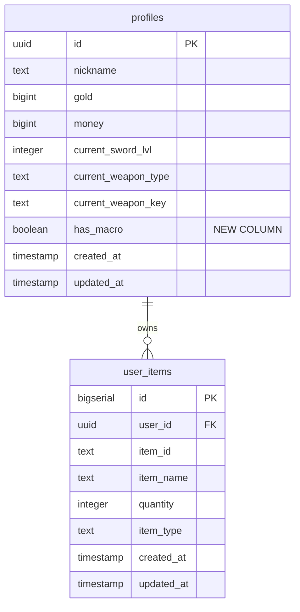
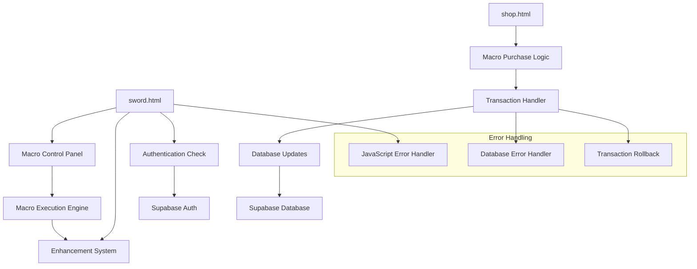

# Design Document: Macro Purchase Fix

## Overview

This design addresses critical issues in the sword enhancement game system that prevent users from purchasing and using the auto-enhancement macro feature. The primary issues are:

1. **Missing Database Column**: The `profiles` table lacks the `has_macro` column that the application code expects
2. **JavaScript Syntax Error**: Duplicate variable declarations in `sword.html` prevent proper page loading
3. **Transaction Safety**: Macro purchases need atomic operations to prevent data corruption
4. **Access Reliability**: Sword page access issues need diagnosis and resolution

The solution involves database schema updates, JavaScript code fixes, improved error handling, and comprehensive testing to ensure system reliability.

## Architecture

### Current System Architecture

The system follows a client-server architecture with:
- **Frontend**: HTML pages with vanilla JavaScript
- **Backend**: Supabase (PostgreSQL database with real-time features)
- **Authentication**: Supabase Auth with session management
- **Data Layer**: Direct database queries from client-side JavaScript

### Database Architecture



### Component Architecture



## Components and Interfaces

### 1. Database Schema Component

**Purpose**: Extend the profiles table to support macro ownership tracking

**Interface**:
```sql
-- New column addition
ALTER TABLE profiles ADD COLUMN has_macro BOOLEAN DEFAULT FALSE;

-- Index for performance
CREATE INDEX IF NOT EXISTS idx_profiles_has_macro ON profiles(has_macro);

-- Update existing users
UPDATE profiles SET has_macro = FALSE WHERE has_macro IS NULL;

-- Add constraint
ALTER TABLE profiles ALTER COLUMN has_macro SET NOT NULL;
```

**Responsibilities**:
- Store macro ownership status per user
- Provide efficient queries for macro ownership checks
- Maintain data integrity during migrations

### 2. JavaScript Error Resolution Component

**Purpose**: Fix duplicate variable declarations and improve code organization

**Current Problematic Code**:
```javascript
// Line 172-173
let macroActive = false;
let macroTargetLevel = 10;
let macroLog = [];

// Line 179-183 (DUPLICATE)
let macroActive = false;  // ERROR: Already declared
let macroInterval = null;
let macroTargetLevel = 10;  // ERROR: Already declared
```

**Fixed Code Structure**:
```javascript
// Consolidated macro variables (single declaration)
let macroActive = false;
let macroTargetLevel = 10;
let macroLog = [];
let macroInterval = null;
let hasMacro = false;
```

**Responsibilities**:
- Eliminate duplicate variable declarations
- Maintain all existing functionality
- Improve code readability and maintainability

### 3. Macro Purchase Transaction Component

**Purpose**: Handle macro purchases with atomic transactions and proper error handling

**Interface**:
```javascript
async function purchaseMacro() {
    // Pre-validation
    if (user.has_macro) {
        throw new Error('ALREADY_OWNS_MACRO');
    }
    
    // Atomic transaction
    const result = await supabaseClient.rpc('purchase_macro_transaction', {
        user_id: user.id,
        required_gold: MACRO_PRICE,
        current_gold: user.gold
    });
    
    if (result.error) {
        throw new Error(result.error);
    }
    
    return result.data;
}
```

**Database Function**:
```sql
CREATE OR REPLACE FUNCTION purchase_macro_transaction(
    user_id UUID,
    required_gold BIGINT,
    current_gold BIGINT
) RETURNS JSON AS $$
DECLARE
    latest_user_data RECORD;
    result JSON;
BEGIN
    -- Lock user row for update
    SELECT gold, has_macro INTO latest_user_data
    FROM profiles 
    WHERE id = user_id 
    FOR UPDATE;
    
    -- Validate current state
    IF latest_user_data.has_macro = TRUE THEN
        RETURN json_build_object('error', 'ALREADY_OWNS_MACRO');
    END IF;
    
    IF latest_user_data.gold < required_gold THEN
        RETURN json_build_object('error', 'INSUFFICIENT_FUNDS');
    END IF;
    
    -- Perform update
    UPDATE profiles 
    SET gold = gold - required_gold, has_macro = TRUE
    WHERE id = user_id;
    
    RETURN json_build_object('success', TRUE, 'new_gold', latest_user_data.gold - required_gold);
END;
$$ LANGUAGE plpgsql;
```

**Responsibilities**:
- Ensure atomic macro purchase operations
- Prevent race conditions and duplicate purchases
- Provide clear error messages for all failure scenarios
- Maintain data consistency

### 4. Macro Ownership Verification Component

**Purpose**: Reliably check and display macro ownership status

**Interface**:
```javascript
async function checkMacroOwnership() {
    try {
        // Always fetch fresh data from database
        const { data: userData, error } = await supabaseClient
            .from('profiles')
            .select('has_macro')
            .eq('id', user.id)
            .single();
        
        if (error) {
            console.error('Macro ownership check failed:', error);
            return false;
        }
        
        const hasMacro = userData.has_macro || false;
        updateMacroUI(hasMacro);
        return hasMacro;
    } catch (error) {
        console.error('Macro ownership verification error:', error);
        return false;
    }
}

function updateMacroUI(hasMacro) {
    const macroPanel = document.getElementById('macroPanel');
    if (macroPanel) {
        macroPanel.style.display = hasMacro ? 'block' : 'none';
    }
}
```

**Responsibilities**:
- Verify macro ownership from authoritative database source
- Update UI based on ownership status
- Handle verification errors gracefully
- Provide real-time ownership status updates

### 5. Access Reliability Component

**Purpose**: Diagnose and resolve sword.html access issues

**Enhanced Error Handling**:
```javascript
async function init() {
    try {
        // Enhanced session validation
        const { data: { session }, error: sessionError } = await supabaseClient.auth.getSession();
        
        if (sessionError) {
            console.error('Session validation error:', sessionError);
            redirectToLogin('Session validation failed');
            return;
        }
        
        if (!session) {
            redirectToLogin('No active session');
            return;
        }
        
        // Enhanced profile loading with retry
        const profileData = await loadUserProfileWithRetry(session.user.id);
        if (!profileData) {
            throw new Error('Failed to load user profile after retries');
        }
        
        user = profileData;
        
        // Initialize page components
        await initializePageComponents();
        
    } catch (error) {
        console.error('Page initialization error:', error);
        showErrorMessage('페이지 로딩 중 오류가 발생했습니다. 페이지를 새로고침해주세요.');
    }
}

async function loadUserProfileWithRetry(userId, maxRetries = 3) {
    for (let attempt = 1; attempt <= maxRetries; attempt++) {
        try {
            const { data, error } = await supabaseClient
                .from('profiles')
                .select('*')
                .eq('id', userId)
                .single();
            
            if (error) {
                throw error;
            }
            
            return data;
        } catch (error) {
            console.warn(`Profile load attempt ${attempt} failed:`, error);
            
            if (attempt === maxRetries) {
                return null;
            }
            
            // Wait before retry (exponential backoff)
            await new Promise(resolve => setTimeout(resolve, 1000 * attempt));
        }
    }
}
```

**Responsibilities**:
- Implement robust session validation
- Provide retry mechanisms for transient failures
- Display clear error messages to users
- Log errors for debugging purposes

## Data Models

### Enhanced Profiles Table Schema

```sql
CREATE TABLE profiles (
    id UUID PRIMARY KEY REFERENCES auth.users(id) ON DELETE CASCADE,
    nickname TEXT,
    gold BIGINT DEFAULT 0,
    money BIGINT DEFAULT 0,
    current_sword_lvl INTEGER DEFAULT 0,
    current_weapon_type TEXT DEFAULT 'normal',
    current_weapon_key TEXT DEFAULT 'sword_01',
    has_macro BOOLEAN DEFAULT FALSE NOT NULL,  -- NEW COLUMN
    created_at TIMESTAMP WITH TIME ZONE DEFAULT NOW(),
    updated_at TIMESTAMP WITH TIME ZONE DEFAULT NOW()
);

-- Indexes for performance
CREATE INDEX IF NOT EXISTS idx_profiles_has_macro ON profiles(has_macro);
CREATE INDEX IF NOT EXISTS idx_profiles_user_lookup ON profiles(id, has_macro);
```

### Migration Script

```sql
-- Migration: Add has_macro column to profiles table
-- This script is safe to run multiple times

-- Step 1: Add column with default value
DO $$ 
BEGIN
    IF NOT EXISTS (
        SELECT 1 FROM information_schema.columns 
        WHERE table_name = 'profiles' AND column_name = 'has_macro'
    ) THEN
        ALTER TABLE profiles ADD COLUMN has_macro BOOLEAN DEFAULT FALSE;
        RAISE NOTICE 'Added has_macro column to profiles table';
    ELSE
        RAISE NOTICE 'has_macro column already exists';
    END IF;
END $$;

-- Step 2: Update existing NULL values to FALSE
UPDATE profiles SET has_macro = FALSE WHERE has_macro IS NULL;

-- Step 3: Add NOT NULL constraint
ALTER TABLE profiles ALTER COLUMN has_macro SET NOT NULL;

-- Step 4: Create index for performance
CREATE INDEX IF NOT EXISTS idx_profiles_has_macro ON profiles(has_macro);

-- Step 5: Verify migration
DO $$
DECLARE
    null_count INTEGER;
BEGIN
    SELECT COUNT(*) INTO null_count FROM profiles WHERE has_macro IS NULL;
    IF null_count > 0 THEN
        RAISE EXCEPTION 'Migration failed: % rows still have NULL has_macro values', null_count;
    ELSE
        RAISE NOTICE 'Migration successful: All profiles have valid has_macro values';
    END IF;
END $$;
```