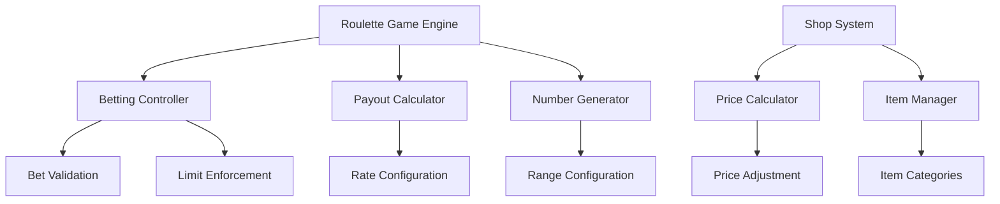

# Design Document: Roulette System Improvements

## Overview

This design outlines the implementation of improvements to an existing roulette gambling system and associated shop pricing. The changes focus on reducing betting limits, adjusting payout rates, expanding the number range, and rebalancing the game economy through strategic price increases.

The modifications aim to improve game balance by reducing risk exposure while maintaining player engagement through expanded betting options. The shop price adjustments support long-term economic sustainability by implementing modest increases that preserve item accessibility while improving revenue.

Key research findings indicate that [roulette systems typically use mathematical probability models](https://dotesports.com/gambling/guides/how-to-play-roulette) with carefully balanced payout rates, and that [virtual game economies require strategic pricing to maintain player engagement](https://thekoalition.com/2026/virtual-currencies-have-become-core-to-modern-game-design) while ensuring sustainable monetization.

## Architecture

The system consists of three main components that require modification:



### Component Interactions

- **Betting Controller** validates and enforces new betting limits
- **Payout Calculator** applies the adjusted 95x multiplier for number bets
- **Number Generator** handles the expanded 0-45 range
- **Price Calculator** applies 5% increases to shop items
- **Configuration System** persists all changes across system restarts

## Components and Interfaces

### Roulette System Components

#### BettingController
```typescript
interface BettingController {
  validateSpecialBets(bets: SpecialBet[]): ValidationResult
  validateNumberBets(bets: NumberBet[]): ValidationResult
  getMaxSpecialBets(): number  // Returns 2
  getMaxNumberBets(): number   // Returns 3
}
```

#### PayoutCalculator  
```typescript
interface PayoutCalculator {
  calculateNumberPayout(bet: NumberBet, winningNumber: number): number
  getNumberPayoutRate(): number  // Returns 95
  calculateSpecialPayout(bet: SpecialBet, winningNumber: number): number
}
```

#### NumberGenerator
```typescript
interface NumberGenerator {
  generateWinningNumber(): number  // Returns 0-45
  getNumberRange(): NumberRange    // Returns {min: 0, max: 45}
  isValidNumber(number: number): boolean
}
```

### Shop System Components

#### PriceCalculator
```typescript
interface PriceCalculator {
  calculateEnhancementPrice(basePrice: number): number  // basePrice * 1.05
  calculateProtectionPrice(basePrice: number): number   // basePrice * 1.05
  applyPriceIncrease(price: number, percentage: number): number
}
```

#### ItemManager
```typescript
interface ItemManager {
  getEnhancementItems(): EnhancementItem[]
  getProtectionItems(): ProtectionItem[]
  updateItemPrices(): void
}
```

### Configuration System

#### ConfigurationManager
```typescript
interface ConfigurationManager {
  saveBettingLimits(specialMax: number, numberMax: number): void
  savePayoutRates(numberRate: number): void
  saveNumberRange(min: number, max: number): void
  saveShopPrices(enhancementIncrease: number, protectionIncrease: number): void
  loadConfiguration(): SystemConfiguration
}
```

## Data Models

### Betting Models
```typescript
interface SpecialBet {
  type: 'red' | 'black' | 'odd' | 'even' | 'high' | 'low'
  amount: number
}

interface NumberBet {
  number: number  // 0-45
  amount: number
}

interface BettingLimits {
  maxSpecialBets: 2
  maxNumberBets: 3
}
```

### Payout Models
```typescript
interface PayoutRates {
  numberBetMultiplier: 95
  specialBetMultipliers: {
    red: number
    black: number
    odd: number
    even: number
    high: number
    low: number
  }
}
```

### Shop Models
```typescript
interface ShopItem {
  id: string
  name: string
  basePrice: number
  currentPrice: number
  category: 'enhancement' | 'protection'
}

interface PriceAdjustment {
  enhancementIncrease: 0.05  // 5%
  protectionIncrease: 0.05   // 5%
}
```

### Configuration Models
```typescript
interface SystemConfiguration {
  bettingLimits: BettingLimits
  payoutRates: PayoutRates
  numberRange: { min: 0, max: 45 }
  priceAdjustments: PriceAdjustment
}
```

## Correctness Properties

*A property is a characteristic or behavior that should hold true across all valid executions of a system—essentially, a formal statement about what the system should do. Properties serve as the bridge between human-readable specifications and machine-verifiable correctness guarantees.*

Based on the prework analysis and property reflection to eliminate redundancy, the following properties ensure system correctness:

### Property 1: Special Betting Limit Enforcement
*For any* betting attempt with special bets, the system should accept at most 2 special bet selections and reject any additional selections
**Validates: Requirements 1.1**

### Property 2: Number Betting Limit Enforcement  
*For any* betting attempt with number bets, the system should accept at most 3 number selections and reject any additional selections
**Validates: Requirements 2.1**

### Property 3: Number Bet Payout Calculation
*For any* winning number bet, the payout should equal the bet amount multiplied by exactly 95
**Validates: Requirements 3.1, 3.2**

### Property 4: Roulette Number Range Generation
*For any* roulette wheel generation or spin, all generated numbers should be within the range 0 to 45 inclusive
**Validates: Requirements 4.1, 4.2**

### Property 5: Number Bet Acceptance Range
*For any* number bet placement attempt, the system should accept bets on any number from 0 to 45 and reject bets on numbers outside this range
**Validates: Requirements 4.3**

### Property 6: Special Bet Range Calculation
*For any* special bet outcome calculation using the expanded range, the determination of odd/even and high/low should correctly use numbers 0-45
**Validates: Requirements 4.5**

### Property 7: Enhancement Item Price Increase
*For any* enhancement item, the displayed and charged price should equal the original price multiplied by 1.05
**Validates: Requirements 5.1, 5.2**

### Property 8: Protection Item Price Increase
*For any* protection item, the displayed and charged price should equal the original price multiplied by 1.05  
**Validates: Requirements 6.1, 6.2**

### Property 9: Price Rounding Consistency
*For any* price calculation result, the final price should be rounded to the nearest appropriate currency unit consistently across all item types
**Validates: Requirements 5.3, 6.3**

### Property 10: Configuration Persistence Round Trip
*For any* configuration change (betting limits, payout rates, or shop prices), saving then loading the configuration should preserve all the modified values
**Validates: Requirements 7.1, 7.2, 7.3, 7.4**

### Property 11: Configuration Validation
*For any* configuration loading attempt, the system should validate all settings before applying them and reject invalid configurations
**Validates: Requirements 7.5**

## Error Handling

### Betting Limit Violations
- **Special Bet Overflow**: When players attempt to exceed 2 special bets, display clear message and maintain current selections
- **Number Bet Overflow**: When players attempt to exceed 3 number bets, display clear message and maintain current selections
- **Invalid Number Range**: Reject bets on numbers outside 0-45 range with appropriate error messages

### Payout Calculation Errors
- **Invalid Bet Amount**: Handle zero or negative bet amounts gracefully
- **Calculation Overflow**: Prevent arithmetic overflow in payout calculations
- **Missing Configuration**: Use safe defaults if payout rates are not configured

### Shop System Errors
- **Price Calculation Failures**: Handle cases where base prices are invalid or missing
- **Rounding Errors**: Ensure consistent rounding behavior across different currency units
- **Insufficient Funds**: Properly handle purchase attempts with insufficient player balance

### Configuration Errors
- **Persistence Failures**: Handle cases where configuration cannot be saved or loaded
- **Validation Failures**: Provide clear error messages for invalid configuration values
- **Migration Errors**: Handle upgrades from old configuration formats gracefully

### Recovery Strategies
- **Graceful Degradation**: System should continue operating with default values if configuration is corrupted
- **Transaction Rollback**: Failed purchases or bets should not affect player balances
- **State Consistency**: Ensure UI and backend remain synchronized during error conditions

## Testing Strategy

### Dual Testing Approach

The testing strategy employs both unit testing and property-based testing as complementary approaches:

**Unit Tests** focus on:
- Specific examples demonstrating correct behavior
- Edge cases and boundary conditions  
- Error handling scenarios
- Integration points between components
- UI display verification for specific states

**Property Tests** focus on:
- Universal properties that hold across all valid inputs
- Comprehensive input coverage through randomization
- Mathematical correctness of calculations
- System behavior under varied conditions

### Property-Based Testing Configuration

**Testing Framework**: Use a property-based testing library appropriate for the target language (e.g., QuickCheck for Haskell, Hypothesis for Python, fast-check for JavaScript/TypeScript)

**Test Configuration**:
- Minimum 100 iterations per property test to ensure comprehensive coverage
- Each property test must reference its corresponding design document property
- Tag format: **Feature: roulette-system-improvements, Property {number}: {property_text}**

**Property Test Implementation Requirements**:
- Each correctness property must be implemented by exactly one property-based test
- Tests should generate random valid inputs within specified constraints
- Assertions should verify the universal quantification statements from the properties
- Edge cases identified in prework should be included in the input generation strategy

### Unit Test Focus Areas

**Betting System Unit Tests**:
- Test betting limit enforcement with specific scenarios (exactly 2 special bets, exactly 3 number bets)
- Test UI message display when limits are exceeded
- Test interface loading with correct limit displays

**Payout System Unit Tests**:
- Test specific payout calculations with known inputs
- Test UI display of payout rates
- Test error handling for invalid bet amounts

**Shop System Unit Tests**:
- Test specific price calculations with known base prices
- Test purchase transactions with exact amounts
- Test UI display of updated prices

**Configuration System Unit Tests**:
- Test specific configuration save/load scenarios
- Test system restart behavior with known configurations
- Test validation with specific invalid configurations

### Integration Testing

**End-to-End Scenarios**:
- Complete betting workflow from selection to payout
- Complete purchase workflow from selection to transaction
- Configuration change workflow from modification to persistence

**Cross-Component Testing**:
- Verify betting limits work correctly with payout calculations
- Verify shop price changes persist across system restarts
- Verify UI updates reflect backend configuration changes

This comprehensive testing approach ensures both mathematical correctness through property-based testing and practical usability through targeted unit tests.